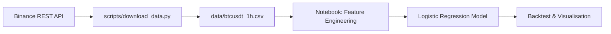

# simple-logistic-regression

Predict next-hour Bitcoin direction with a lightweight logistic regression pipeline fed by five technical factors (Momentum, SMA distance, Volatility, RSI, Volume). Data is sourced directly from Binance and explored inside a companion Jupyter notebook.

## Project Layout
- `scripts/download_data.py` – pull 1h BTCUSDT klines from Binance and save to `data/`
- `data/` – cached CSV datasets generated by the downloader
- `notebooks/bitcoin_logistic_regression.ipynb` – end-to-end walkthrough covering feature engineering, training, and backtesting
- `.venv`, `pyproject.toml`, `uv.lock` – uv-managed Python environment and dependency locks

## Quick Start (uv)
1. Install dependencies inside the local uv environment:
   ```bash
   uv sync
   ```
2. Refresh data (defaults to the last 120 days of hourly candles):
   ```bash
   uv run python scripts/download_data.py --symbol BTCUSDT --interval 1h --days 180
   ```
3. Launch Jupyter and open the notebook:
   ```bash
   uv run jupyter notebook notebooks/bitcoin_logistic_regression.ipynb
   ```

## Feature Set
| Factor | Definition |
| --- | --- |
| Momentum | 24-hour percentage change of closing price |
| SMA Distance | Difference between spot close and 24-hour SMA |
| Volatility | Rolling 24-hour standard deviation of log returns |
| RSI | 14-period Relative Strength Index |
| Volume | 24-hour rolling z-score of trade volume |

Targets are defined as the sign of the next hour’s percentage return, giving a balanced binary classification problem once class weights are applied.

## Backtesting
The notebook produces:
- Classification metrics (accuracy, precision/recall/F1)
- Logistic regression coefficient bar chart for interpretability
- Cumulative equity curves comparing the strategy (long when probability > 0.5) versus buy & hold

Remember to account for fees and slippage before treating the backtest as tradable performance.

## Architecture Diagram


## Next Ideas
- Extend factor library (e.g. MACD, Bollinger Bands) and perform feature selection
- Evaluate alternative models (tree ensembles, neural nets) with walk-forward validation
- Introduce transaction cost modelling and position sizing rules
